# Token Sweeper Architecture

## System Overview

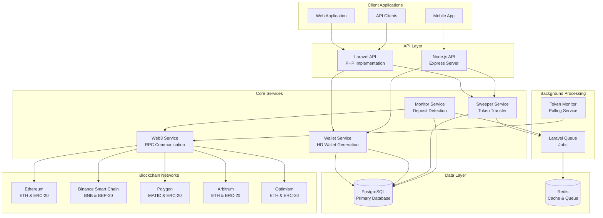

## Sweep Workflow

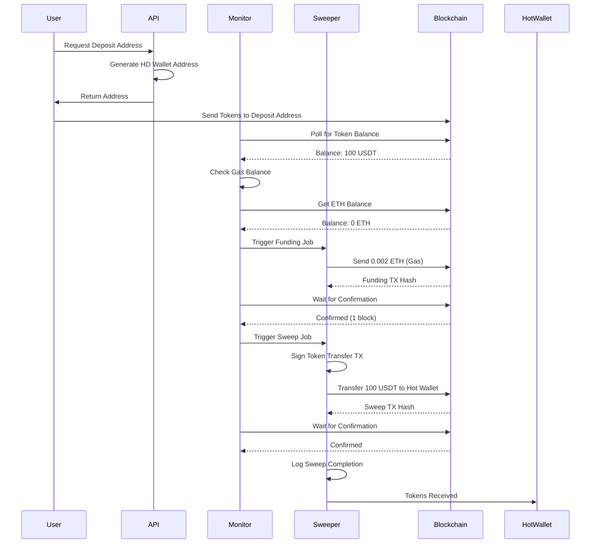

## Component Architecture

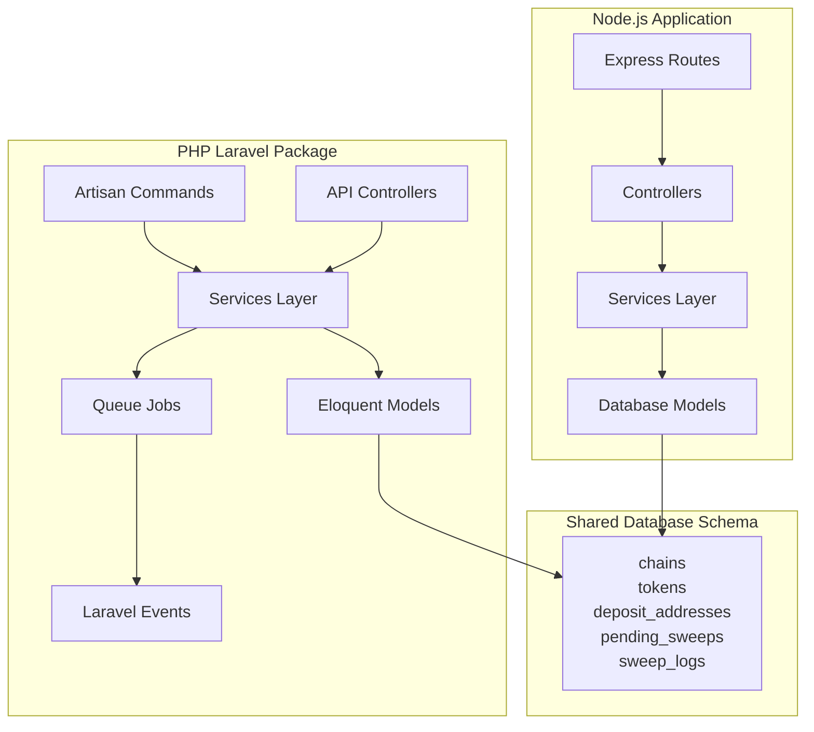

## Data Flow - Token Sweep

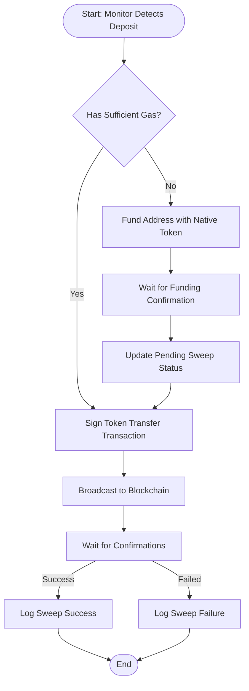

## Database Schema

```mermaid
erDiagram
    chains ||--o{ tokens : "has many"
    chains ||--o{ deposit_addresses : "has many"
    chains ||--o{ pending_sweeps : "has many"
    chains ||--o{ sweep_logs : "has many"

    chains {
        bigint id PK
        integer chain_id UK
        string name
        string native_symbol
        string rpc_url
        boolean is_active
        timestamp created_at
        timestamp updated_at
    }

    tokens {
        bigint id PK
        integer chain_id FK
        string contract_address
        string symbol
        string name
        integer decimals
        boolean is_active
        timestamp created_at
        timestamp updated_at
    }

    deposit_addresses {
        bigint id PK
        bigint user_id
        integer chain_id FK
        string address UK
        integer derivation_index
        text private_key_encrypted
        timestamp created_at
        timestamp updated_at
    }

    pending_sweeps {
        bigint id PK
        string deposit_address
        string token_address
        integer chain_id FK
        string amount
        string status
        string funding_tx_hash
        string sweep_tx_hash
        integer retry_count
        text error_message
        timestamp created_at
        timestamp updated_at
    }

    sweep_logs {
        bigint id PK
        string deposit_address
        string token_address
        integer chain_id FK
        string amount
        string status
        string funding_tx_hash
        string sweep_tx_hash
        string gas_used
        text error_message
        timestamp created_at
    }
```

## Service Layer Architecture

### PHP Services

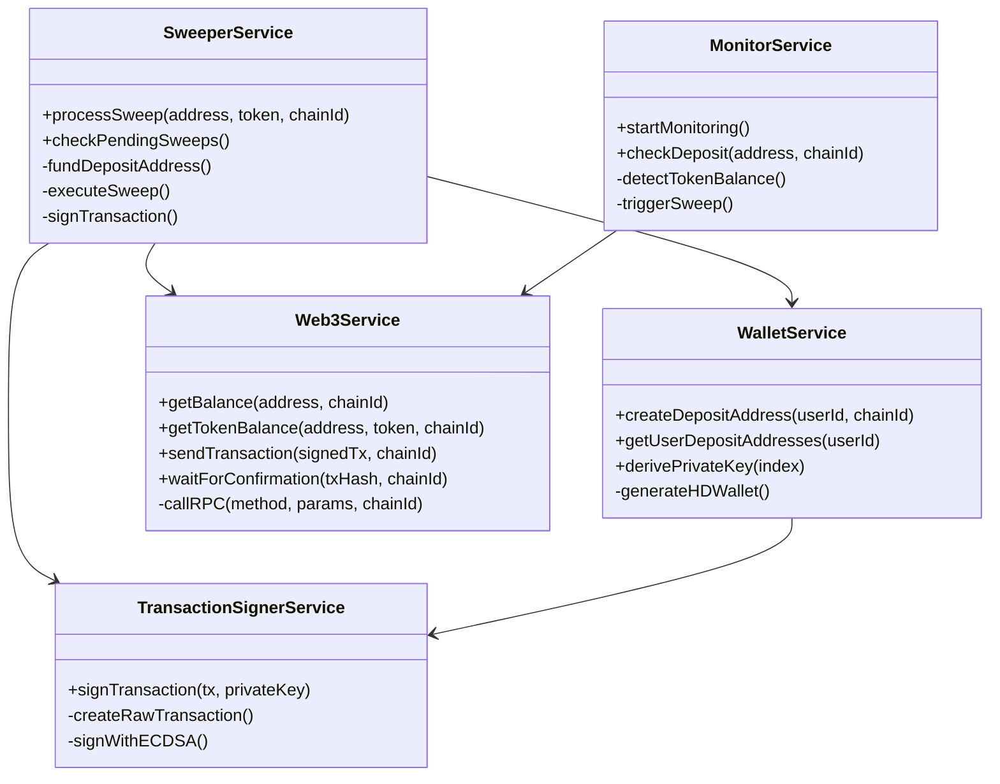

### Node.js Services

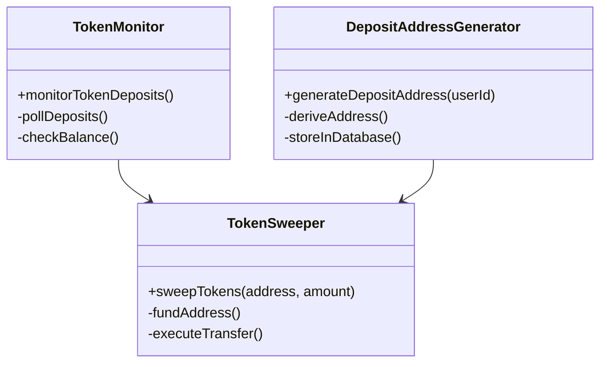

## Event-Driven Architecture (Laravel)

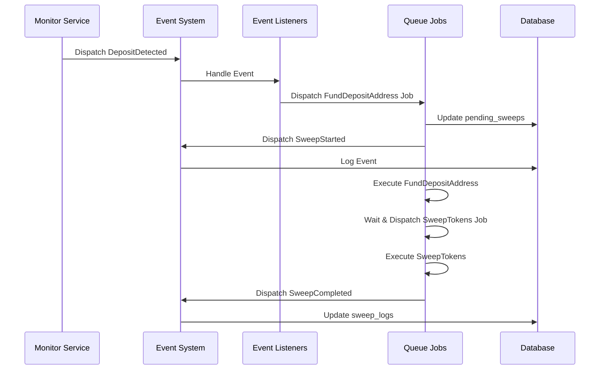

## Multi-Chain Configuration

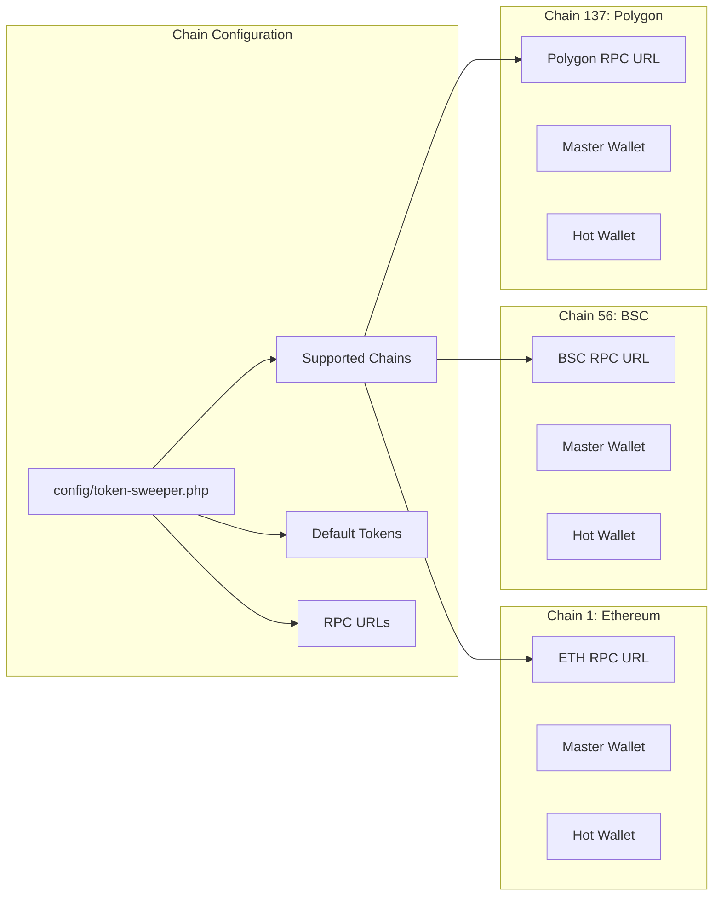

## Security Architecture

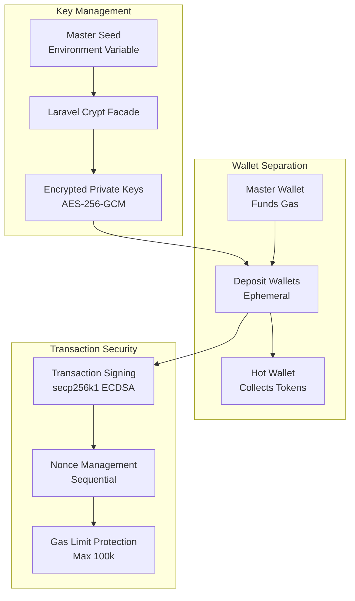

## Deployment Architecture

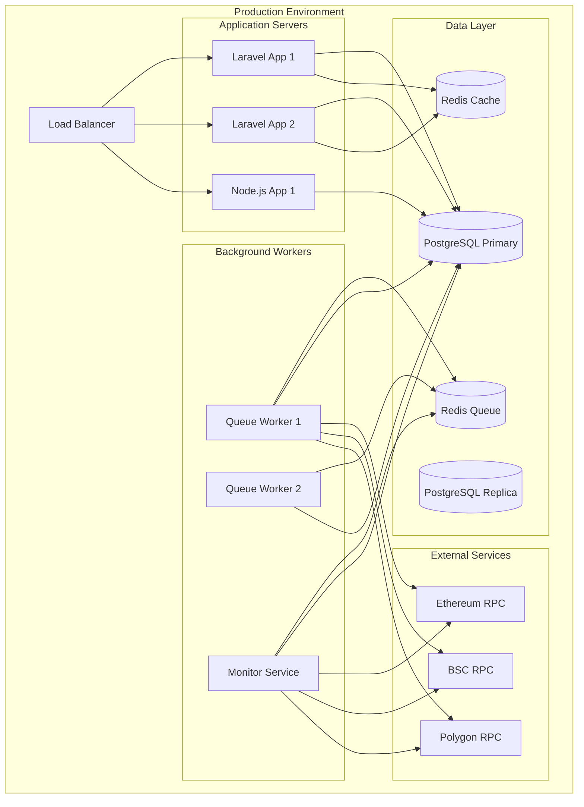

## Technology Stack

### Backend Frameworks
- **Laravel 10/11** - PHP framework for web API and background processing
- **Express.js 4.18** - Node.js framework for lightweight API server

### Blockchain Libraries
- **simplito/elliptic-php** - Elliptic curve cryptography for PHP
- **ethers.js v6** - Ethereum library for Node.js
- **kornrunner/keccak** - Keccak-256 hashing for Ethereum addresses

### Database & Cache
- **PostgreSQL 12+** - Primary relational database
- **Redis 6+** - Cache and queue backend

### Testing
- **PHPUnit 11** - PHP unit and feature testing
- **Orchestra Testbench** - Laravel package testing framework
- **Jest 29** - JavaScript testing framework

### DevOps & Tooling
- **Composer** - PHP dependency management
- **npm** - Node.js package management
- **Laravel Queue** - Background job processing
- **Artisan CLI** - Laravel command-line tools

## Key Design Patterns

### 1. Service Layer Pattern
Encapsulates business logic in dedicated service classes, separating concerns from controllers and models.

### 2. Repository Pattern
Models act as repositories, providing data access abstraction with Eloquent ORM.

### 3. Event-Driven Architecture
Uses Laravel events and listeners for decoupled component communication.

### 4. Queue-Based Processing
Asynchronous processing of long-running sweep operations using Laravel queues.

### 5. HD Wallet Derivation
BIP-44 compliant hierarchical deterministic wallet generation for secure address creation.

### 6. Strategy Pattern
Configurable chain-specific settings (RPC URLs, gas amounts, confirmation blocks).

## Scalability Considerations

### Horizontal Scaling
- **API Servers**: Multiple Laravel/Node.js instances behind load balancer
- **Queue Workers**: Multiple workers processing jobs concurrently
- **Monitor Services**: Distributed monitoring across chains

### Database Optimization
- **Indexed Columns**: chain_id, user_id, deposit_address, status
- **Read Replicas**: Separate read/write database instances
- **Connection Pooling**: Efficient database connection management

### Caching Strategy
- **Chain Metadata**: Cache chain and token configurations
- **RPC Responses**: Cache blockchain data with TTL
- **User Addresses**: Cache frequently accessed deposit addresses

### Rate Limiting
- **RPC Requests**: Implement backoff and retry logic
- **API Endpoints**: Rate limit user requests
- **Queue Jobs**: Throttle concurrent sweep operations

## Monitoring & Observability

### Metrics
- **Sweep Success Rate**: Percentage of successful sweeps
- **Average Sweep Time**: Time from detection to completion
- **Gas Costs**: Track gas spending across chains
- **Queue Depth**: Monitor pending job backlog

### Logging
- **Application Logs**: Laravel logs for errors and events
- **Sweep Logs**: Database table tracking all sweep operations
- **Transaction Logs**: On-chain transaction hashes and confirmations

### Alerts
- **Failed Sweeps**: Alert on repeated failures
- **Low Gas Balance**: Alert when master wallet balance is low
- **RPC Failures**: Alert on blockchain connectivity issues
- **Queue Backlog**: Alert when queue depth exceeds threshold
